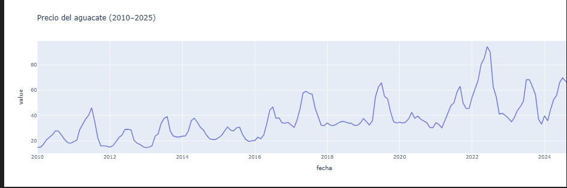
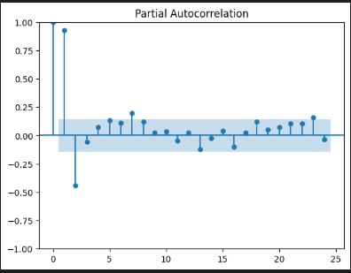
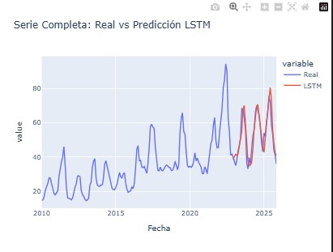
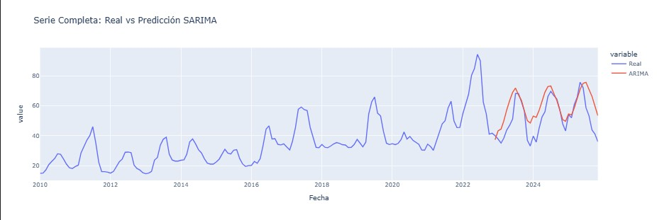
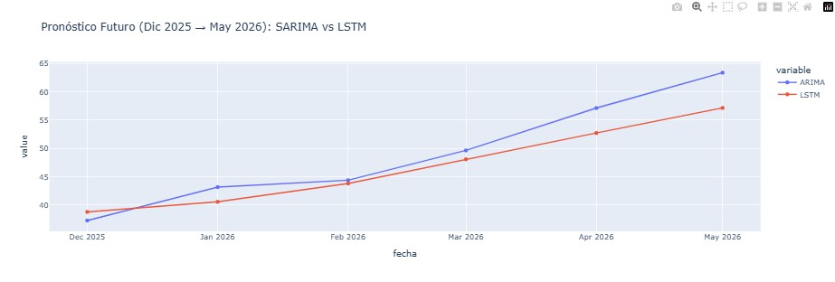

# examenfinal_modelos

## Introducción 

En este proyecto se analizó la serie temporal del precio mensual (por kg) del aguacate Hass en el Mercado de Abastos de Guadalajara desde enero de 2010 hasta noviembre de 2025 (191 observaciones).

Esta serie es relevante porque el aguacate es uno de los productos agrícolas más importantes de México, tanto por su consumo interno como por su impacto económico en exportaciones, adémas fue un tema de elección por todo lo qu eha sucedido recientemente en varios estados de México sobre las protestas de los agricultores y el efecto del precio debido a ello.

Conocer su comportamiento histórico permite identificar tendencias de crecimiento, estacionalidad y periodos de alta volatilidad.

Realizar un pronóstico del precio puede ayudar a anticipar costos, planear producción, evaluar riesgos y apoyar decisiones comerciales dentro de la cadena de suministro.

El impacto de mi área personal/profesional simplemente puede ser en el incremento o decremento del precio de este alimento que es consumido semanalmente en mi hogar; por otro aldo profesionalmente diría en el análisis de los cambios/variaciones de precio gracias a eventos de la república.

## Preparación del dataset

Fuente de datos: https://www.economia-sniim.gob.mx/CuadroAnualCons.asp?prod=133&uni=&ori=T&pres=T&dest=140&anio=2024

Para el csv, tuve que hacerlo yo misma (quería valores de México, si agarraba de Kaggle muchos eran de USA, es por eso que tomé SNIIM) por lo que decidí agarrar datos desde 15 años atrás de la actual, por lo que desde el Enero 2010 hasta Noviembre 2025.

Cuenta con `fecha`, `precio mensual por kg`, `mercado` que mi elección fue el **Mercado de Abastos de Guadalajara, Jalisco, que es donde me encuentro.

### Limpieza

Se hizo una pequeña corrección de espacios (que fue un error de dedo por mi) en los nombres de las columnas, se hizo una conversión de fechas dejando el día primero, con el tema de valores faltantes únicamente había uno que en la página no se encontraba por lo que lo rellené con el promedio y por último se les dio un índice. 

### Gráficas exploratorias 

En la gráfica podemos observar claramente una tendencia en subida de precio del 2010-2022

Y una mayor volatilidad en el año 2023 a 2025 ya que no se observa la tendencia que llevaba años anteriores.

Si se cuenta con estacionalidad anual, con picos recurrentes mayormente entre junio y agosto de cada año. Es por eso que se eligió SARIMA en primer lugar.

## Ingeniería de Características

### Escalamiento

Para ek modelo de LSTM se realizó un escalamiento con StandarScaler, para SARIMA no fue necesario.

### Tamaño de ventana para pronósticos

Al ser la serie mensual (precio kg al mes) se usó una ventana de 12 meses para que de esta manera lstm aprendiera patrones y poder predecir el siguiente mes, ene se caso diciembre 2025.

En sarima de igual manera se fijó con 12 meses y lo dejé de esta manera para no hacerlo demasiado grande y evitar el overfitting.

### Variables externas (si usan series multivariables)

En este caso no fue necesaria otra variable, únicamente con la variable precio.

## Modelado

### Arquitectura del modelo

- Modelo SARIMA:

(2,1,2)(1,1,1,12) y fue ne base a ACF y PACF, como la la serie sí mostró estacionalidad anual y tendencia es por eso que fue sarima en vez de arima.

- Modelo LSTM:

Decidí usar dos capas de LSTM, la primera 64 neuronas para capturar mejor las dependencias a largo plazo; la segunda de 32 neuronas para procesar la info. anterior. De igual amnera dos capas Dense de 16 neuronas y la final para la predicción siguiente. Activación 'tanh' y activación 'relu'  para Dense.

### Justificación de hiperparámetros

Los valores de SARIMA fueron abase de las gráficas ACF y PACF con una diferenciación para estacioanr la serie (eliminar tendencia) y como se explicó anteriormente 12 porque la serie es mensual.

Los valors de LSTM se utilizó un batch de 16 ya que la base de datos no es tan grande, con optimizer Adam ya que es bueno y rápido, con ventana de 12 meses de estacionalidad anual y 200 épocas.

### Explicación del procedimeinto de entrenamiento

Para SARIMA el modelo se basa en los años que se establecieron (2010-2025), se hace la estimaciónd e parámetros de la máxima verosimilitud y búsqueda de coeficientes. Se hacen pronósticos de los meses futuros. 

Con LSTM se hace el escalamiento en los rangos [-1,1], se divide el dataset en train y test 80-20, en el entrenamiento con secuencia de 12 pasos, se minimiza el MSE, se hacen evaluaciones contra el conjunto test y también s egeneran pronósticos para los próximos meses. 

## Evaluación 

### Métricas

| Modelo | RMSE | MAE | MAPE |
|--------|----------------------|----------------------|----------------------|
| **LSTM** | 5.755980439454111 | 4.15304187350803 | 8.444722560886108 |
| **SARIMA** | 10.83826090443759 | 2.9103769797355086 | 19.078678655799994 |

### Gráfica real vd predicción

### Comparación con datos reales 

## Conclusión

